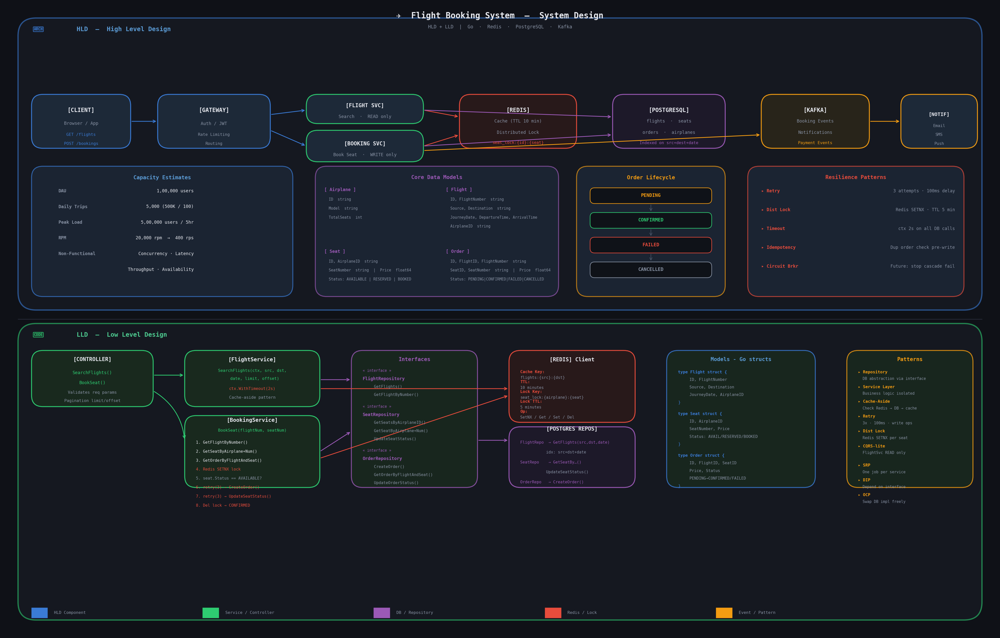

# Flight Booking System – LLD Assignment

---

## Part 1: Initial Design (What I Built First)

### Problem Statement

Designed a basic Flight Booking System supporting:

- Search flights by source, destination, and date
- View available seats
- Book a seat on a flight
- Store data in a InMemory
- Expose simple REST APIs

### Basic Architecture

```
Client → Controller → Service → Repository → Database
```

### Core Components

| Layer | Responsibility |
|---|---|
| Controller | Handle HTTP requests |
| Service | Business logic |
| Repository | DB operations |
| Database | PostgreSQL persistence |

### APIs Designed

- `GET /flights?source=&destination=&date=` – Search flights
- `GET /flights/{id}/seats` – View available seats
- `POST /bookings` – Book a seat

### Data Models

**flights** – id, source, destination, journey_date, total_seats, available_seats  
**seats** – id, flight_id, seat_number, status (AVAILABLE / BOOKED)  
**orders** – id, flight_id, seat_id, user_id, status (PENDING / CONFIRMED / FAILED / CANCELLED)

### Booking Flow (Initial)

1. Validate flight exists
2. Validate seat exists
3. Check seat is available
4. Create order
5. Update seat status to BOOKED

### Design Patterns Used (Initial)

- Repository Pattern – abstracted DB from business logic
- Service Layer Pattern – business logic separated from controllers

---

## Part 2: Flight-Service Addition
---

### Redis Caching for Flight Search

**Problem:** Every search hit the DB even for repeated identical queries.

**Solution:** Cache-aside pattern using Redis.

```
Cache Key:  flights:{source}:{destination}:{date}
TTL:        10 minutes
```

**Flow:**
- Cache HIT → return cached result directly
- Cache MISS → query DB → store result in Redis → return result

**Where used:** `FlightService.SearchFlights()`

**Benefits:** Reduced DB load, faster response time, scales for read-heavy traffic.

---

### Distributed Locking for Seat Booking

**Problem:** Multiple concurrent users could book the same seat simultaneously, causing double booking.

**Solution:** Redis-based distributed lock using SETNX per seat.

```
Lock Key:  seat_lock:{flightId}:{seatId}
TTL:       5 minutes (auto-expiry fallback)
```

**Where used:** `BookingService.BookSeat()`

**Benefits:** Prevents race conditions in distributed deployments, ensures strong consistency at application level.

---

### Retry Mechanism

**Problem:** Transient DB failures broke the booking flow entirely.

**Solution:** Retry wrapper with 3 attempts and 100ms delay.

```
retry(3, 100ms, fn)
```

**Where used:**
- Order creation
- Seat status update

**Benefits:** Handles transient failures gracefully, reduces request failure rate.

---

### Request Timeout Handling

**Problem:** Slow DB calls could block threads/goroutines indefinitely.

**Solution:** Context-level timeout on all DB calls.

```go
context.WithTimeout(ctx, 2*time.Second)
```

**Where used:** `FlightService.SearchFlights()`

**Benefits:** System fails fast instead of hanging, predictable API latency, protects from slow downstream dependencies.

---

### Separation of Read and Write Services

**Problem:** Single service was handling both reads and writes — violates SRP and harder to scale independently.

**Solution:** Split into two services.

| Service | Responsibility |
|---|---|
| FlightService | Read operations (search flights) |
| BookingService | Write operations (booking flow) |

**Benefits:** Follows Single Responsibility Principle, each service can scale independently.

---

### Idempotency in Booking Flow

**Problem:** Client retries could create duplicate bookings.

**Solution:** Check for existing order before creating a new one (duplicate order guard).

**Benefits:** Safe retries from client side, prevents duplicate bookings, ensures data consistency.

---

### Standardized Error Handling

Added structured error types:

- `BadRequestError` – invalid input from client
- `InternalServerError` – unexpected server failures

**Benefits:** Consistent API responses, easier debugging, better client integration.

---

### Repository Abstraction Layer

Defined clear interfaces:

- `FlightRepository`
- `SeatRepository`
- `OrderRepository`

Services depend on interfaces, not concrete DB implementations.

**Benefits:** Loose coupling, easier unit testing with mocks, DB flexibility (swap Postgres → MySQL without touching service logic).

---

### Logging & Observability

Added structured logs at all service layers:

```
[BOOKING_START]
[CACHE_HIT] / [CACHE_MISS]
[RETRY]
[ERROR]
```

**Benefits:** Easier debugging, production tracing, better observability.

---

### Database Indexing

Added composite index for the most common query pattern:

```sql
CREATE INDEX idx_flights_source_destination_date
ON flights (source, destination, journey_date);
```

**Benefits:** Faster search queries, optimized filtering, better DB performance under load.

---

### Pagination Support

Added `limit` and `offset` to `SearchFlights` controller and repository.

**Benefits:** Prevents large data fetches, scales search API.

---

## SOLID Principles Applied

| Principle | Where Applied |
|---|---|
| SRP – Single Responsibility | FlightService (reads only), BookingService (writes only), Controller (HTTP only) |
| OCP – Open/Closed | Repository interfaces allow new DB implementations without changing service logic |
| LSP – Liskov Substitution | Any FlightRepository implementation (mock, postgres, mysql) can replace another |
| ISP – Interface Segregation | Separate interfaces for FlightRepo, SeatRepo, OrderRepo instead of one fat interface |
| DIP – Dependency Inversion | Services depend on interfaces, not concrete DB structs |

---

## Final Design Patterns Used

| Pattern | Where Used |
|---|---|
| Repository Pattern | FlightRepo, SeatRepo, OrderRepo |
| Service Layer Pattern | FlightService, BookingService |
| Cache-Aside Pattern | Flight search with Redis |
| Retry Pattern | DB write operations |
| Distributed Lock Pattern | Seat booking with Redis |
| CQRS-Inspired Separation | Read service vs Write service split |

---

## Final Architecture Overview

```
User → API Gateway (Auth + Routing)
     → FlightService (Search + Cache)   → Redis (Cache)
     → BookingService (Booking + Lock)  → Redis (Distributed Lock)
                                        → PostgreSQL (DB)
                                        → Kafka (Async events – future)
```

## System Design Diagram (HLD + LLD)



> Full system design showing High Level Architecture (request flow, capacity estimates, data models, order lifecycle, resilience patterns) and Low Level Design (controller, services, interfaces, Redis keys, Postgres repos, Go structs, design patterns).

---

## Order Lifecycle

```
PENDING → CONFIRMED
        → FAILED
        → CANCELLED
```

---

## Future Improvements (Planned)

- Kafka-based async payment flow
- Seat inventory as a separate microservice
- Saga pattern for distributed transactions
- Rate limiting at API Gateway
- Read replicas for scaling search
- Event-driven seat updates
- Airline Integration

---